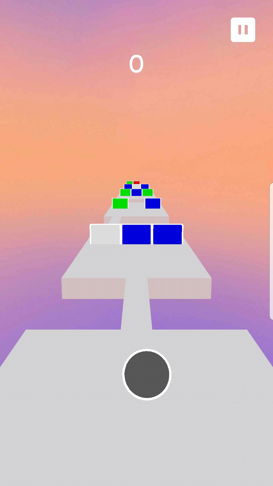
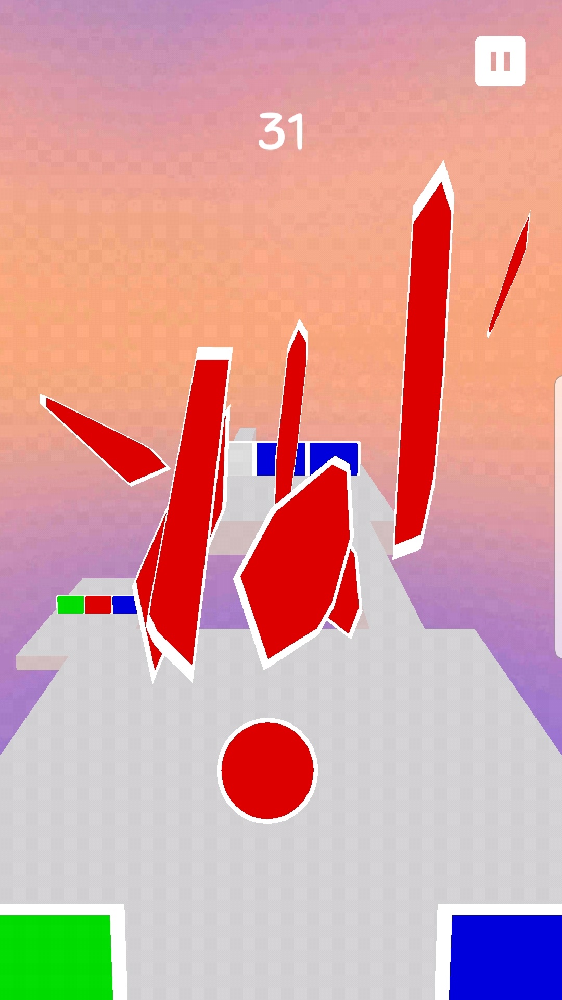
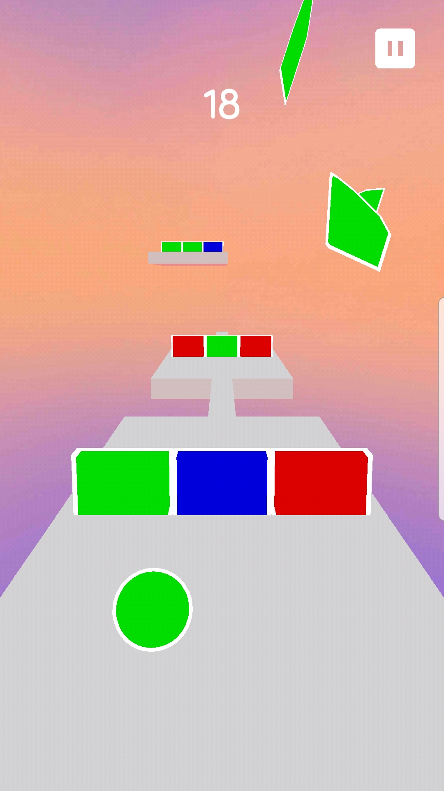
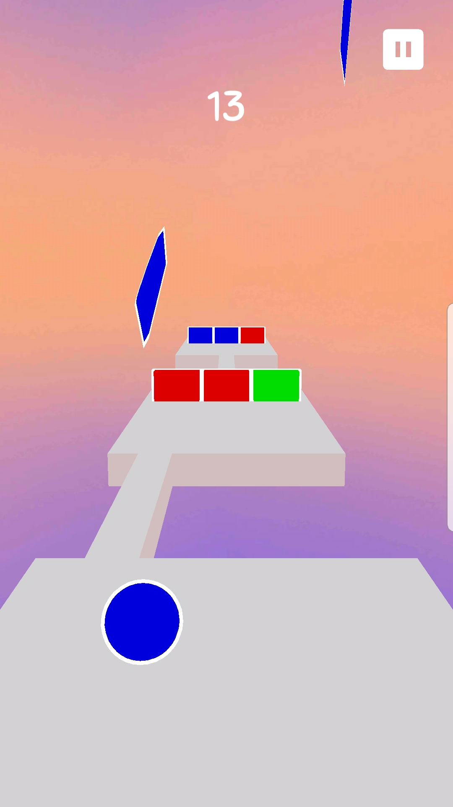

# Breaking Walls
 

A casual endless runner game inspired by the likes of Temple Run and Subway Surfer. Unlike the former games, Breaking Walls add an element of color and color-matching to the mix, making the player decide on which color is best suited for the situation.

 

## Gameplay
---
* Tap on the ball to switch colors.
* Match the color of the ball to the color of the wall to break through it. Otherwise you'll bonk your ball on the wall.
* Color-changing walls!
* The more walls you break, the higher your score!
* Speed of the game increases with the more walls you break.
* Use either the tilt function of the phone or swipe with your fingers to move the ball from side-to-side (no jumping, sorry).
* Relaxing background music to listen to.

 

## Features
---
* Google Play Games Service integration.
* Game data saved using both local device storage and cloud storage through Google Drive (no data is collected or used on our end).
* Google Ad-Mob integration (no other ad networks implemented). Banner, interstitial and rewarded video ads are implemented throughout the game.
* Achievements and leaderboards integrated through Google Play Games Service!

 

## Technical Features
---
* Walls shatter using basic physics.
* All platforms (including walls) seen in the game are pooled, only 5 platforms (plus 3 walls for each platform) are spawn and used througout the entire game to preserve system resources and maintain performance.
* The ball stays in place while the platforms move towards the player.
* The length of the platform and bridges are dynamically adjusted based on the current speed of the game.

 

## Screenshots
---

 

## Notes:
---
* Was previously released to the Google Play Store, but is no longer available.
* Breaking Walls 2...?

 

## License:
---
* © 2018-2022 Victor Dang All Rights Reserved
* You may download and modify this project for educational and non-commerical use.